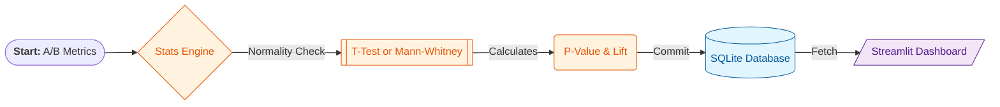

# 📈 StatGuard-Metric: Adaptive ML Experimentation Framework

**StatGuard-Metric** is a professional engineering framework for A/B testing and scientific validation of ML models. It automatically selects the optimal statistical criteria based on data distribution, protecting businesses from false-positive conclusions and random noise.

## 🌟 Key Features
*   **Scientific Rigor:** Automated normality check using the **Shapiro-Wilk test**.
*   **Adaptive Testing:** Dynamic switching between **Student's T-Test** (parametric) and **Mann-Whitney U-test** (non-parametric).
*   **Persistence Layer:** Full logging of every experiment into a persistent **SQLite** database.
*   **Live Dashboard:** Interactive visualization of results and experiment history via **Streamlit & Plotly**.

## 🛠 Tech Stack
*   **Stats Engine:** SciPy, NumPy, Statsmodels.
*   **Data Management:** SQLite, Pandas.
*   **Visualization:** Streamlit, Plotly.
*   **Core:** Python 3.11+, OOP Architecture.

## 📈 Data Pipeline (Architecture)
1.  **Ingestion:** Simulating or loading metrics from Group A and Group B.
2.  **Profiling:** Assessing distribution shape and statistical assumptions.
3.  **Inference:** Executing tests, calculating **P-Value** and **Lift**.
4.  **Logging:** Committing test metadata to the SQL storage.
5.  **Visualization:** Rendering the analytical dashboard for business decision-making.

## 🧠 Decision Logic
The system selects the algorithm based on data properties:
1. **Normality Check (Shapiro-Wilk):**
   - If $p > 0.05$ (Normal) $\rightarrow$ **Student's T-Test**.
   - If $p < 0.05$ (Skewed) $\rightarrow$ **Mann-Whitney U-Test**.
2. **Lift Calculation:** Measuring the relative effect size.
3. **Audit Trail:** Automated logging of results to the SQL database.

## 🛡️ Robustness Features
*   **Outlier Resistance:** Automatic fallback to non-parametric tests for "noisy" infrastructure data.
*   **Data Validation:** Integrated cleaning pipeline to handle missing values (NaN) before processing.
*   **Safe Path Resolution:** Cross-platform path handling (`os.path.abspath`) for reliable deployment on Mac/Linux/Win.

## 📸 Real Case: From Metrics to Verdict

| **Distribution View** | **Stats Analysis** | **Business Verdict** |
| :--- | :--- | :--- |
|  | `P-Value: 0.0004`, `Lift: +5.65%` | **✅ Approved.** Difference is statistically significant. Deploying new model. |

## 💰 Business Impact
*   **Evidence-Based Decisions:** Eliminates human bias in model evaluation.
*   **Risk Mitigation:** Prevents deployment of models showing "random" growth.
*   **Historical Audit:** A complete trail of all experiments for retrospective analysis.

## 🛠 Installation & Usage
1. **Clone repo:** `git clone https://github.com`
2. **Setup env:** `python -m venv .venv && source .venv/bin/activate`
3. **Install:** `pip install -r requirements.txt`
4. **Run Pipeline:** `python main.py`
5. **View Dashboard:** `streamlit run app.py`

## 🗺 Future Roadmap
- [ ] **Bayesian Methods:** Implementing Bayesian A/B testing for smaller sample sizes.
- [ ] **A/B/C Support:** Testing multiple variants simultaneously.
- [ ] **Alerting:** Integration with Slack/Telegram for instant experiment notifications.

## 🤝 Contributing
